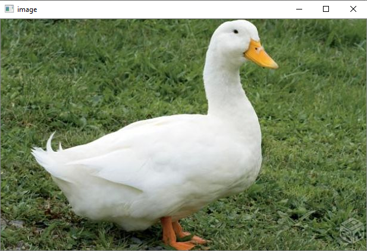
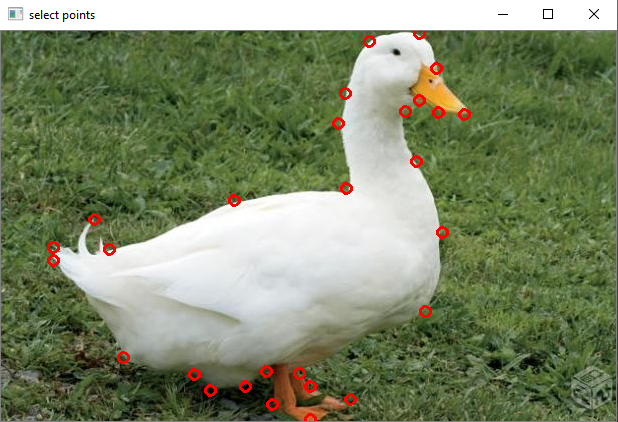
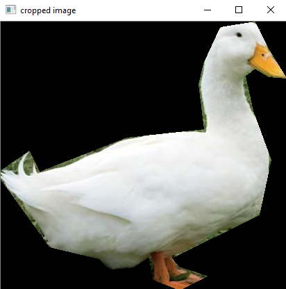

# [Image and video cutter by points](https://github.com/LucasdRossi/image-video-cutter)

### Dependences:
- **numpy** and **OpenCV**

### Getting started:
First you will need to install de dependences with [pip](https://pypi.org/project/pip/).  
`$ pip install numpy && pip install opencv-python`  

There are  three ways to start the application:  
1. Using an **image**:    
`$ python ./main.py -img <path_to_image>`  
2. Using your **webcam**:    
`$ python ./main.py -v CAM`  
3. Using a **video**:    
`$ python ./main.py -v <path_to_video>`    

### How to use:  
With the image open you can press **`s`** and a new tab will be opened for you to select the points you want. Then ou need to press **`c`** to cut the image.  
To quit the application simply press **`q`** any time.  

### Examples:
- Original Image:  
  

- Image with the selected points:  
  

- Cropped image:  
  
